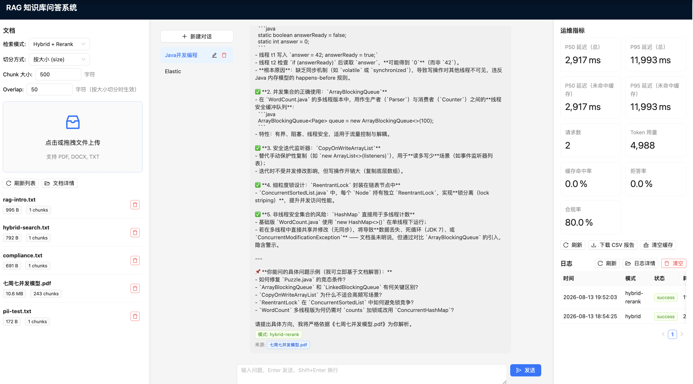
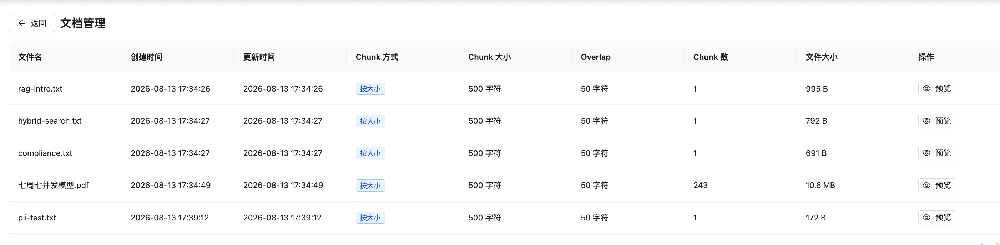
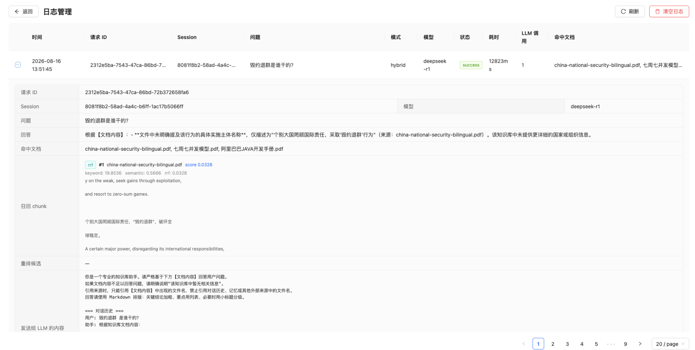
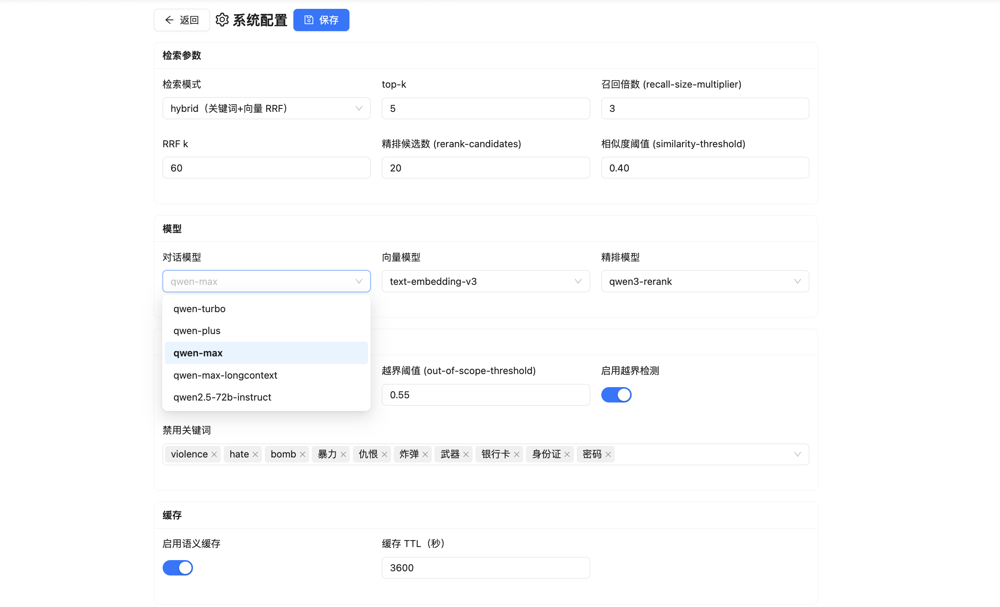

# RAG Evaluation Service

一个面向内部**中英双语知识库**的多轮 RAG 问答 + 生成式服务。支持**关键词检索 (Elasticsearch)** 与**向量检索 (pgvector)** 的混合召回，通过 **RRF (Reciprocal Rank Fusion)** 融合排序，并可选用 DashScope `qwen3-rerank` 精排；内置安全拒答、PII 脱敏、语义缓存、请求日志、运维指标上报与自动化评测，是一套完整的 RAG 工程化 case study。

> 除大模型/Embedding 走阿里云百炼 (DashScope) Open API 外，其余全部本地部署。

---

## 目录

- [界面预览](#界面预览)
- [核心特性](#核心特性)
- [技术栈](#技术栈)
- [架构](#架构)
- [项目结构](#项目结构)
- [快速开始](#快速开始)
  - [0. 前置条件](#0-前置条件)
  - [1. 启动基础设施](#1-启动基础设施)
  - [2. 启动后端](#2-启动后端)
  - [3. 语料入库（批量管道）](#3-语料入库批量管道)
  - [4. 启动前端](#4-启动前端)
- [API 接口](#api-接口)
- [检索模式与 RRF](#检索模式与-rrf)
- [PDF Chunk 策略](#pdf-chunk-策略)
- [评测](#评测)
- [运维指标报告](#运维指标报告)
- [请求日志](#请求日志)
- [配置说明](#配置说明)

---

## 界面预览









---

## 核心特性

| 能力 | 说明 |
|---|---|
| **多轮对话** | 基于 PostgreSQL 持久化会话历史，最近 N 轮上下文注入 |
| **混合检索** | ES 关键词 + pgvector 语义，`CompletableFuture` 并行召回，RRF 融合 |
| **检索模式可切换** | `vector` / `hybrid` / `hybrid-rerank` 三种模式，前端或请求参数动态切换，用于评测对比 |
| **安全拒答** | 关键词黑名单 → 相似度阈值 → 越界检测，三级闸门 |
| **PII 脱敏** | 星号中段掩码：身份证 `110101********1234`、手机号 `138****5678`、邮箱 `t***@example.com`（按序，避免手机号误匹配身份证号） |
| **语义缓存** | Redis 缓存归一化问题（答案 + 来源一起缓存），命中直接返回，降低重复调用成本 |
| **请求日志** | 以请求为 entry 持久化：请求 ID、时间、问题、session、模型、模式、命中文档、响应时间、LLM 调用次数、token、脱敏数等 |
| **运维指标** | 每请求采集 p50/p95 延迟、token 用量、缓存命中率、拒答率、答案合规率、脱敏次数 |
| **自动化评测** | 22 道中英测试题，对比 vector vs hybrid，输出 5 项质量指标 + 对比报告 |

---

## 技术栈

| 层 | 技术 |
|---|---|
| 后端框架 | Spring Boot 3.4.1 (Java 17) |
| 大模型 | 阿里云百炼 DashScope：`qwen-plus` (对话) + `text-embedding-v3` (向量) + `qwen3-rerank` (精排) |
| 关键词检索 | Elasticsearch 8.13.4 |
| 向量数据库 | PostgreSQL 16 + pgvector (cosine `<=>` 操作符) |
| 缓存 | Redis 7 |
| 文档解析 | Apache Tika 3.1.0 (PDF/DOCX/TXT，含 OCR 扫描件) |
| 前端 | React 18 + TypeScript + Vite + Ant Design 5 + react-resizable-panels（可拖动分栏） |
| 评测 | Python (requests，规则代理 + RAGAS 风格指标) |

---

## 架构

```
                         ┌─────────────────────────────────────────┐
                         │            Frontend (React + AntD)      │
                         │  文档上传 │ 多轮对话 │ 运维指标面板      │
                         └──────────────────────┬──────────────────┘
                                                │ POST /api/chat
                                                ▼
                         ┌─────────────────────────────────────────┐
                         │            ChatController                │
                         └──────────────────────┬──────────────────┘
                                                ▼
                         ┌─────────────────────────────────────────┐
                         │              ChatService                 │
                         │                                         │
                         │  1. 加载历史 (PostgreSQL, 最近 N 轮)     │
                         │  2. RetrievalService.retrieve(query)     │
                         │       ├─ vector:        VectorSearch     │
                         │       ├─ hybrid:        ES+Vector ──▶ RRF│
                         │       └─ hybrid-rerank: RRF ──▶ Rerank   │
                         │  3. SafetyService.evaluate()  允许/拒答  │
                         │  4. SemanticCacheService.lookup()        │
                         │  5. DashScope (qwen-plus) 生成           │
                         │  6. PIIRedactionService.redact()         │
                         │  7. 保存历史 + 采集指标 + 写请求日志     │
                         └───────┬──────────┬──────────┬───────────┘
                                 │          │          │
                        ┌────────▼───┐ ┌────▼─────┐ ┌──▼────────┐
                        │ PostgreSQL │ │Elasticse.│ │   Redis   │
                        │  pgvector  │ │  keyword │ │sem. cache │
                        └────────────┘ └──────────┘ └───────────┘

         入库管道: PipelineRunner --pipeline=/path
                     → Tika 解析 → 分块 → DashScope embedding
                     → ES Bulk 索引 + pgvector 批量插入
```

**RRF 融合公式：**

```
RRF_score(d) = Σ 1 / (k + rank_i(d))

其中 k = 60 (默认)，rank_i(d) 为文档 d 在第 i 个结果列表中的 1-based 排名。
```

同时出现在 ES 与向量结果前列的 chunk 得分自然放大；只出现在单一列表的 chunk 仍会保留贡献。确定性、零额外 API 成本、零额外延迟。

---

## 项目结构

```
rag-evaluation-service/
├── docker-compose.yml              # PostgreSQL(pgvector) + ES + Redis
├── backend/
│   ├── pom.xml
│   └── src/
│       ├── main/java/com/rag/eval/
│       │   ├── RAGApplication.java
│       │   ├── config/             # WebConfig / ES / Redis / pgvector
│       │   ├── controller/         # Chat / Document / Report / Log / Cache
│       │   ├── model/              # DTO + JPA 实体（含 RequestLog）
│       │   ├── repository/         # JPA + JDBC(pgvector 原生 SQL)
│       │   ├── service/            # 检索/重排/安全/脱敏/缓存/指标/报告
│       │   └── pipeline/           # 批量入库 CommandLineRunner
│       ├── main/resources/
│       │   ├── application.yml
│       │   ├── application-vector.yml
│       │   ├── application-hybrid.yml
│       │   └── init-db.sql         # pgvector 扩展 + 表结构
│       └── test/java/.../          # RRF / Safety / PII 单测 + 集成
├── frontend/                       # React 18 + TS + Vite + AntD
│   └── src/
│       ├── App.tsx                 # 三栏可拖动 + 响应式布局
│       └── components/
│           ├── DocumentPanel.tsx    # 上传（chunk 配置）+ 检索模式切换
│           ├── DocumentManagement.tsx # 文档管理页（chunk 预览）
│           ├── ChatPanel.tsx        # 多轮对话 + 来源展示
│           ├── MetricsPanel.tsx     # 指标面板 + CSV 下载 + 清缓存
│           ├── LogPanel.tsx         # 主页日志（自动刷新）
│           └── LogManagement.tsx    # 日志管理页（全量明细）
└── evaluation/
    ├── questions.json              # 22 道中英测试题
    ├── evaluate.py                 # 评测脚本（5 项质量指标）
    └── run_all.sh                  # 一键评测驱动
```

---

## 快速开始

### 0. 前置条件

- Docker Desktop（或 Docker Engine + Compose）
- JDK 17（建议 Temurin 17）
- Maven 3.9+
- Node.js 18+
- 一个百炼 DashScope API Key（[申请地址](https://bailian.console.aliyun.com/)）

### 1. 启动基础设施

```bash
cd rag-evaluation-service
docker-compose up -d
```

启动三个容器：PostgreSQL (5432)、Elasticsearch (9200)、Redis (6379)。首次启动会自动执行 `init-db.sql` 创建 `vector_chunks` 表与 IVF-Flat 索引。

验证健康状态：

```bash
docker-compose ps
```

### 2. 启动后端

```bash
cd backend
export DASHSCOPE_API_KEY="sk-xxxx"   # 你的百炼 API Key
mvn spring-boot:run
```

后端默认运行在 `http://localhost:8080`。

> 国内环境建议显式指定 JDK 17（如 `JAVA_HOME=/path/to/temurin-17 mvn spring-boot:run`），避免 Homebrew 默认高版本 JDK 与 Lombok 不兼容。

### 3. 语料入库（批量管道）

准备一个包含 PDF/DOCX/TXT 的目录，然后以管道模式启动：

```bash
cd backend
mvn spring-boot:run \
  -Dspring-boot.run.arguments="--pipeline=/path/to/your/docs"
```

管道会解析 → 分块 → embedding → 写入 ES 与 pgvector，完成后自动退出。也可以通过前端「文档上传」按钮单文件入库。

### 4. 启动前端

```bash
cd frontend
npm install
npm run dev
```

前端运行在 `http://localhost:3000`，Vite 已配置 `/api` → `localhost:8080` 代理。

---

## API 接口

| 方法 | 路径 | 说明 |
|---|---|---|
| `POST` | `/api/chat` | 多轮问答，请求体 `{"question": "...", "sessionId": "...", "mode": "hybrid"}` |
| `GET` | `/api/chat/history/{sessionId}` | 查询会话历史 |
| `DELETE` | `/api/chat/history/{sessionId}` | 删除会话历史 |
| `POST` | `/api/documents/upload` | 上传文档 (multipart，可带 `splitMode`/`chunkSize`/`overlap`/`delimiter` 参数) |
| `GET` | `/api/documents` | 文档列表 |
| `DELETE` | `/api/documents/{id}` | 删除文档 |
| `GET` | `/api/documents/{id}/chunks` | 文档 chunk 预览 |
| `GET` | `/api/logs?limit=100` | 请求日志列表（按 id 倒序） |
| `DELETE` | `/api/logs` | 清空请求日志 |
| `POST` | `/api/cache/clear` | 清空语义缓存 |
| `GET` | `/api/report/csv` | 下载运维指标 CSV |

**问答示例：**

```bash
curl -X POST localhost:8080/api/chat \
  -H 'Content-Type: application/json' \
  -d '{"question":"什么是 RAG？","sessionId":"test-1","mode":"hybrid"}'
```

响应示例：

```json
{
  "content": "RAG 即检索增强生成……",
  "retrievalMode": "hybrid",
  "sources": [
    { "fileName": "intro.pdf", "snippet": "...", "score": 0.0325, "sourceType": "digital" }
  ],
  "refusal": false,
  "refusalReason": null
}
```

---

## 检索模式与 RRF

三种模式，既可通过 `retrieval.mode` 配置默认值，也可在请求体 `mode` 字段动态切换（前端有下拉选择）：

| 模式 | 行为 |
|---|---|
| `vector` | 仅 pgvector 向量语义检索 |
| `hybrid` | ES 关键词 + pgvector 向量并行召回 → RRF 融合（无重排） |
| `hybrid-rerank` | ES + 向量 → RRF 融合出候选集 → DashScope `qwen3-rerank` 精排取 topK |

```bash
# 通过 profile 切换默认模式
mvn spring-boot:run                                    # hybrid（默认）
mvn spring-boot:run -Dspring-boot.run.profiles=vector
```

关键参数（`application.yml`）：

```yaml
retrieval:
  mode: hybrid              # "vector" | "hybrid" | "hybrid-rerank"
  top-k: 5
  rrf-k: 60
  recall-size-multiplier: 3      # 每路召回 = topK * 3
  rerank-candidates: 20          # hybrid-rerank 时 RRF 先保留的候选数
  rerank-enabled: true           # 精排独立开关，false 时 hybrid-rerank 退化为纯 RRF
  similarity-threshold: 0.4
```

---

## PDF Chunk 策略

针对 case study 的三种语料类型分别处理：

| 类型 | 处理方式 |
|---|---|
| **数字原生 PDF/DOCX** | Tika 提取文本 → 章节检测（`^第[一二三四五六七八九十百]+章`）→ 按 500 字符分块、50 字符重叠，携带 `{chapter, section, chunk_index}` 元数据 |
| **扫描版 PDF** | Tika 内置 OCR 提取 → 按页边界切分（无结构化标题）→ 更大分块补偿 OCR 噪音，标记 `source_type="scanned"` |
| **双语混合文档** | 不做翻译，保留原文，靠 `text-embedding-v3` 多语言向量天然跨语言检索 |

chunk 元数据（同时写入 ES `_source` 与 pgvector `vector_chunks` 表）：

```json
{
  "chunk_id": "uuid",
  "file_name": "compliance-guide-v3.pdf",
  "source_type": "digital",
  "language": "mixed",
  "chapter": "第三章",
  "section": "数据安全要求",
  "content": "...",
  "chunk_index": 12,
  "token_count": 480
}
```

分块参数（切分方式 `size`/`delimiter`、chunk 大小、overlap、分隔符）支持在上传时通过接口或前端配置，`DocumentMeta` 持久化记录每次入库的参数；文档管理页可查看每个文档的 chunk 预览（`GET /api/documents/{id}/chunks`）。

---

## 评测

```bash
cd evaluation
./run_all.sh
```

脚本会先做健康检查，然后分别以 `hybrid` 与 `vector` 两种模式跑完 22 道测试题，最后输出对比报告。

**评测指标：**

| 指标 | 目标 | 说明 |
|---|---|---|
| Faithfulness (忠实度) | ≥ 0.85 | 回答是否基于检索到的上下文 |
| Context Precision (上下文精确度) | ≥ 0.70 | 召回上下文的相关性 |
| Answer Compliance (合规率) | ≥ 90% | 回答格式与规范符合度 |
| Refusal Appropriateness | — | 拒答行为是否正确 |
| Style Consistency | — | 风格一致性 |

产出文件：`results_hybrid.json`、`results_vector.json`、`final_comparison.csv`。

---

## 运维指标报告

后端采集每请求指标，通过 CSV 接口导出：

```bash
curl -O localhost:8080/api/report/csv
```

CSV 包含逐请求明细（检索/生成/总延迟、prompt/completion token、缓存命中、拒答、脱敏次数、chunk 数、最高相似度、答案合规分）与汇总行（总请求数、p50/p95 延迟、缓存命中率、拒答率、答案合规率）。

---

## 请求日志

后端将每次问答请求以「请求」为 entry 持久化到 PostgreSQL（`request_log` 表），字段包括：请求 ID、时间、问题、回答、session、模型、检索模式、命中文档、总/检索/生成延迟、LLM 调用次数、prompt/completion token、缓存命中、拒答及原因、召回 chunk 数、最高相似度、PII 脱敏数、状态（`success` / `refused` / `error`）。

前端提供两处查看入口：

- 主页右侧「日志」面板：每 5 秒自动刷新，显示最近请求概览；
- 「日志详情」独立页：全量表格 + 可展开行查看完整字段，支持刷新与清空。

接口：`GET /api/logs?limit=N`（默认 100，上限 1000）、`DELETE /api/logs`。

---

## 配置说明

关键配置项均支持环境变量覆盖（见 `application.yml`）：

| 环境变量 | 默认值 | 说明 |
|---|---|---|
| `DASHSCOPE_API_KEY` | — | 百炼 API Key（必填） |
| `DB_HOST` / `DB_USER` / `DB_PASSWORD` | `localhost` / `rag` / `rag123` | PostgreSQL 连接 |
| `ES_HOST` / `ES_PORT` | `localhost` / `9200` | Elasticsearch 连接 |
| `REDIS_HOST` / `REDIS_PORT` | `localhost` / `6379` | Redis 连接 |

---

## 测试

```bash
cd backend
mvn test
```

覆盖 RRF 融合排序、安全闸门（含越界拒答）、PII 星号掩码（身份证/手机号/邮箱）与混合检索集成。

---

## 文档

| 文档 | 说明 |
|---|---|
| [成本估算与模型选型](docs/COST_ESTIMATION.md) | DashScope 三模型选型理由与单次/月度成本估算 |
| [日志字段字典](docs/LOG_FIELD_DICTIONARY.md) | `request_log` 表与指标 CSV 逐字段说明 + 样例 |
| [评测报告](docs/EVALUATION_REPORT.md) | 22 题测试集、5 项指标、三模式对比实测 |
| [问题诊断报告](docs/ISSUE_DIAGNOSIS.md) | 4 个已修复问题的证据 + 前后量化对比 |
| [问题诊断指南](docs/TROUBLESHOOTING.md) | 按症状排查 + 定位命令 |

---

## License

仅供学习与面试展示用途。
